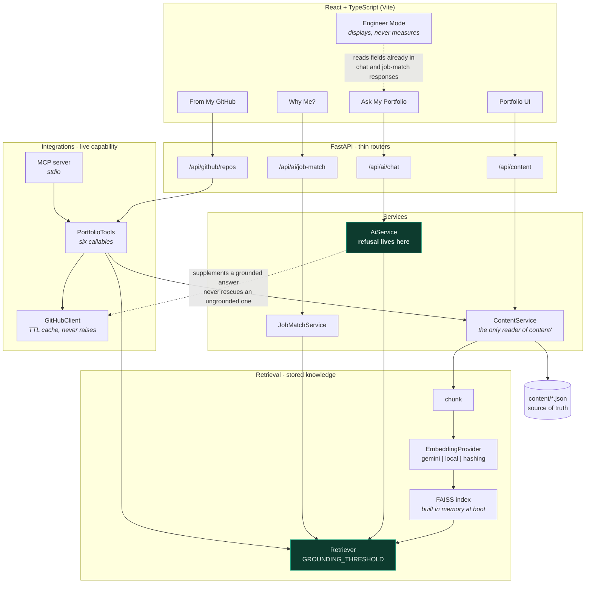

# Architecture

## System

```
                        React + TypeScript (Vite)
                     Portfolio UI  ·  Ask My Portfolio
                     Why Me?       ·  Engineer Mode
                                │
                                │  HTTP / JSON
                                ▼
                             FastAPI
                        backend/app/api/
                                │
             ┌──────────────────┼──────────────────┐
             │                  │                  │
        Portfolio            RAG               Agents
         Service           Service            Workflow
      services/          rag/               agents/
             │                  │                  │
             │            Vector Store             │
             │           FAISS index               │
             │                  │                  │
             └──────────────────┼──────────────────┘
                                │
                ┌───────────────┴───────────────┐
                ▼                               ▼
          AIProvider                    EmbeddingProvider
             ai/                              rag/
   Gemini · Ollama · template          Gemini · local MiniLM

                     External Context
                     integrations/
                            │
                  GitHub API  ·  MCP Server
```

## Diagram

Rendered by GitHub. Mermaid rather than an exported image so it diffs in git and
needs no tool to edit.



**What the diagram is saying.** `content/*.json` feeds both the UI and the AI,
through one reader. Retrieval answers from stored knowledge; integrations reach
live capability; the two never merge (rule 15). Refusal is decided in
`AiService` against a retrieval threshold *before* any model runs — which is
also why the MCP `search_resume` tool, reading the retriever directly, does not
inherit that guarantee.

## Content is the single source of truth

```
              content/*.json
      (profile, experience, skills, projects, notes)
                     │
        ┌────────────┴────────────┐
        ▼                         ▼
   ContentService            RAG ingestion
        │                         │
   REST endpoints           chunks + embeddings
        │                         │
   Portfolio UI            Ask My Portfolio, Why Me?, agents
```

The same JSON renders the site *and* grounds every AI answer. That is what makes
the AI features part of the product rather than bolted-on demos - and it is why
the assistant cannot claim experience the resume does not contain.

## Request flows

**Ask My Portfolio (RAG)**

```
Question -> EmbeddingProvider -> FAISS top-k -> build grounded prompt
         -> AI provider -> answer + source citations
                        -> Engineer Mode metrics
```

**Why Me? / Job Match (Agentic)**

```
Job description
   -> RequirementAgent   extract required skills
   -> PortfolioAgent     retrieve evidence per requirement (reuses RAG)
   -> EvidenceAgent      confirm match / partial / gap - no evidence, no claim
   -> ResponseAgent      compose the final narrative
```

Each agent is a Python module with one responsibility, run in sequence and
streamed to the UI as visible progress steps.

**Ask My Engineering Context (RAG + MCP/tools)**

```
Question ──┬─> RAG        -> stored portfolio knowledge
           └─> GitHub tool -> live public repositories
                          -> merged, separately attributed answer
```

Stored knowledge and live capability stay visibly distinct - that distinction is
the point of the feature.

## Design rules

- `api/` stays thin; behaviour lives in `services/`, `rag/`, `ai/`, `agents/`.
- One RAG implementation, one generation abstraction, one embedding abstraction.
- Both providers are env-var selected: offline locally, serverless in production.
- Adding a tool never reshapes RAG. RAG = stored knowledge; MCP = live capability.
- Every AI answer carries its sources; missing evidence is stated, never filled in.
- The site degrades gracefully: no LLM configured still yields a working,
  retrieval-grounded answer.
